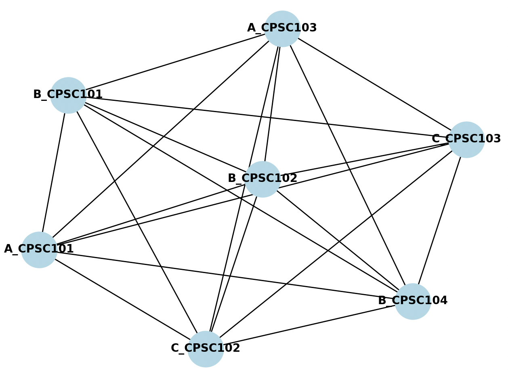

# CSP AI Professor Assignment

This repository contains scripts related to Constraint Satisfaction Problems (CSP) for the assignment of professors to courses. The scripts are part of an AI exercise and focus on solving the problem of scheduling professors for specific courses while adhering to various constraints.


## Contents

* `CSP_Solver.py`: Python script utilizing the `python-constraint` library to model and solve the CSP for professor-course assignments.
* `ConstraintGraph.py`: Python script for constructing a constraint graph related to the CSP.

## Course Information

**Course:** CPSC 481-05 - Artificial Intelligence
**Instructor:** Professor Kenytt Avery
**University:** California State University Fullerton
**Exercise:** Exercise 4 - Fall 2023

## Problem Description

Consider the problem of assigning professors to teach courses in a computer science department. The constraints and preferences for this problem are as follows:

* Professor A can teach CPSC 101 and CPSC 103.
* Professor B can teach CPSC 101, CPSC 102, and CPSC 104.
* Professor C can teach CPSC 102 and CPSC 103.
* CPSC 101 and CPSC 104 are scheduled for 7:00 pm on Mondays.
* CPSC 102 and CPSC 103 are scheduled for 9:00 pm on Wednesdays.
* Professor A does not want to teach CPSC 103 this semester.
* The department plans to offer at least one class to each professor.

# About Constraint Satisfaction Problems (CSP)

## What is CSP?

Constraint Satisfaction Problems (CSP) are a key concept in artificial intelligence for solving problems with constraints. CSPs involve assigning values to variables while adhering to specified constraints.

## Components:

1. **Variables:** Entities to which values are assigned (e.g., professors, days).
2. **Domains:** Sets of values variables can take.
3. **Constraints:** Rules limiting variable combinations.

## Solving CSPs:

Solving a CSP entails finding consistent variable assignments that meet all constraints. Algorithms like backtracking are commonly used.

## Real-World Applications:

CSPs find use in scheduling, configuration, puzzle-solving, and more, providing a structured approach to complex problems.

## Why Learn CSP?

Understanding CSPs is vital for AI, operations research, and computer science. It enhances problem-solving skills and offers insights into decision-making processes.

Explore the scripts in this repository to see CSPs in action and deepen your problem-solving capabilities.

## Questions and Answers For Problem

### 1. Define the set of variables Xi and the domains Dj for each variable.

* Variables Xi: {A_CPSC101, A_CPSC103, B_CPSC101, B_CPSC102, B_CPSC104, C_CPSC102, C_CPSC103}
* Domains Dj:
  * A_CPSC101: {7:00 pm on Mondays}
  * A_CPSC103: {Not available}
  * B_CPSC101: {7:00 pm on Mondays}
  * B_CPSC102: {9:00 pm on Wednesdays}
  * B_CPSC104: {7:00 pm on Mondays}
  * C_CPSC102: {9:00 pm on Wednesdays}
  * C_CPSC103: {9:00 pm on Wednesdays}

### 2. List the unary constraints for this problem.

* A_CPSC103 ≠ 7:00 pm on Mondays (Professor A does not want to teach CPSC 103 this semester)

### 3. List the binary constraints for this problem.

* CPSC 101 and CPSC 104 are scheduled for the same time on Mondays.
* CPSC 102 and CPSC 103 are scheduled for the same time on Wednesdays.

### 4. List the preference constraints for this problem.

* Ensure that each professor teaches at least one class.

### 5. Construct a constraint graph for this problem.



## Getting Started

### Prerequisites

* Python 3.x
* Install required Python packages:

```bash
pip install -r requirements.txt
```

### Usage

1. Clone the repository:

```bash
git clone https://github.com/abelxmendoza/CSP-AI-ProfessorAssignment.git
```

2. Navigate to the repository:

```bash
cd CSP-AI-ProfessorAssignment
```

3. Run the CSP solver script:

```bash
python3 CSP_Solver.py
```

4. Run the Constraint Graph script:

```bash
python3 ConstraintGraph.py
```

## Contributing

If you have suggestions or improvements, feel free to open an issue or create a pull request. Contributions are welcome!

## License

This project is licensed under the [MIT License](https://chat.openai.com/c/LICENSE).

## Documentation

Assignment Submission:

[https://docs.google.com/document/d/1h4M-IueEFTKt-olsMWisFFHuS9oMp9TwNNQRK9h1DY0/edit?usp=sharing](https://docs.google.com/document/d/1h4M-IueEFTKt-olsMWisFFHuS9oMp9TwNNQRK9h1DY0/edit?usp=sharing)

Assignment Guidline:
[https://docs.google.com/document/d/1yRi3DX3ymrS2gjkOO1dWZOXBvU4ZVZsEWDbd8jfUnlk/edit?usp=sharing
](https://docs.google.com/document/d/1yRi3DX3ymrS2gjkOO1dWZOXBvU4ZVZsEWDbd8jfUnlk/edit?usp=sharing)

[
](https://docs.google.com/document/d/1h4M-IueEFTKt-olsMWisFFHuS9oMp9TwNNQRK9h1DY0/edit?usp=sharing)

## Acknowledgment

I would like to express my sincere gratitude to Professor Kenytt Avery for teaching CPSC 481-05 - Artificial Intelligence at California State University Fullerton. This exercise has provided valuable insights into Constraint Satisfaction Problems (CSP) and has been instrumental in enhancing my problem-solving skills in the field of artificial intelligence.

Thank you, Professor Avery, for your guidance and support throughout this exercise.

---
